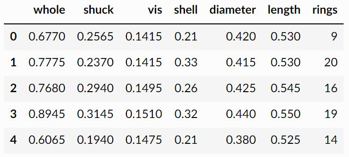
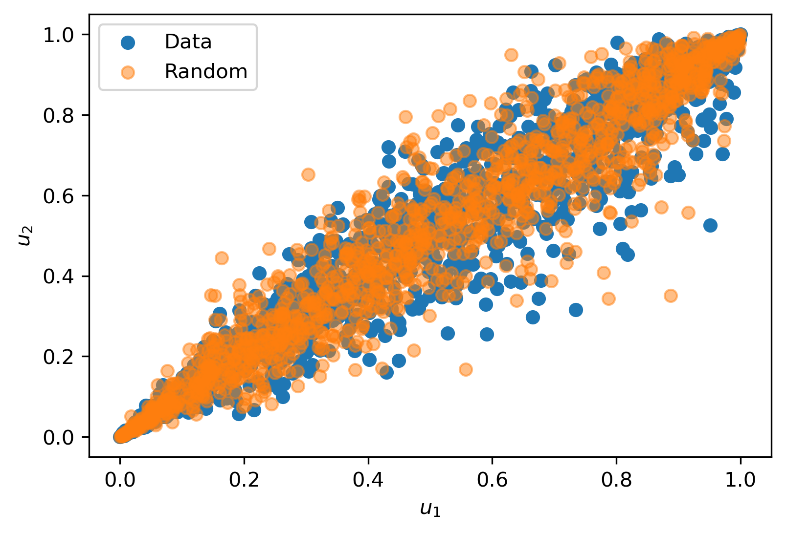

# VineCopulas


[](https://github.com/VU-IVM/VineCopulas)
[](https://github.com/VU-IVM/VineCopulas)
[](https://vinecopulas.readthedocs.io/en/latest/?badge=latest) 
[](https://badge.fury.io/py/VineCopulas)

A pure python implementation for vine copulas

## Installation

```
pip install vinecopulas
```

## Getting Started 

Get started by testing checking out the package functionality using the [Abalone](http://archive.ics.uci.edu/ml/datasets/Abalone) example data.

```python
import pandas as pd
import matplotlib.pyplot as plt
import numpy as np
from vinecopulas.marginals import *
from vinecopulas.bivariate import *

datapath = 'https://raw.githubusercontent.com/VU-IVM/vinecopula/develop/doc/sample_data.csv'
df = pd.read_csv(datapath)
df.head()
```


Transform the data to pseudo data and fit a survival gumbel copula between two variables. Use the fitted copula to generate random samples.

```python
x = np.array(df)[:,:-1]
u =  pseudodata(x) # computes the pseudodata
cop = 4 # copula 4 is the gumbel copula with 180 degree rotation
par = fit(cop, u[:,:2]) # fit the variables in the first 2 columns 
n = len(u) # number of samples to generate 
ur = random(cop, par, n) # generate random samples
# plot
plt.scatter(u[:,0],u[:,1], label = 'Data')
plt.scatter(ur[:,0], ur[:,1], alpha = 0.5, label = 'Random')
plt.xlabel('$u_1$')
plt.ylabel('$u_2$')
plt.legend()
```


Fit a vine copula between multiple variables in the data, considering all possible copulas available in the package.

```python
cops = list(range(1,16)) # fit vine copula according to these copulas
M, P, C = vinecop(u, cops, vine = 'R') #fit R-vine
plotvine(M,variables = list(df.columns[:-1]), plottitle = 'R-Vine') #plot structure
```

## Contribution Guidelines
---

**Please note:** This package is still in development phase. In case of any problems, or if you have any suggestions for improvements, please raise an *issue*. 
